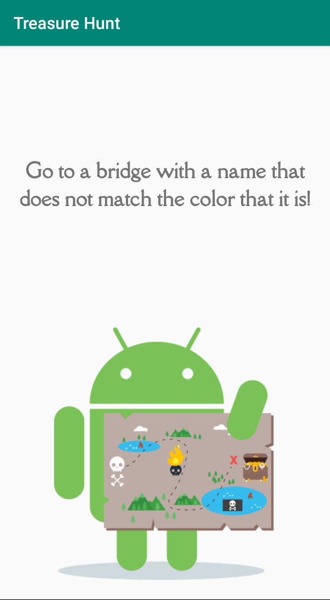
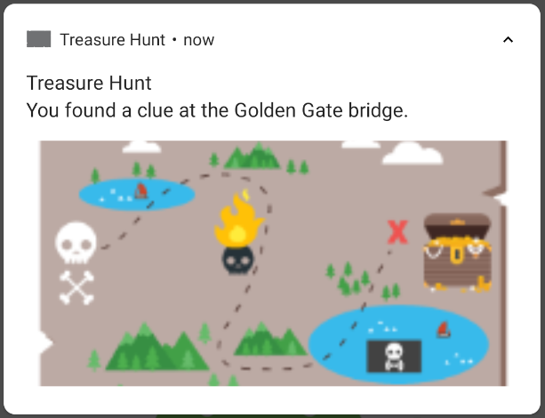
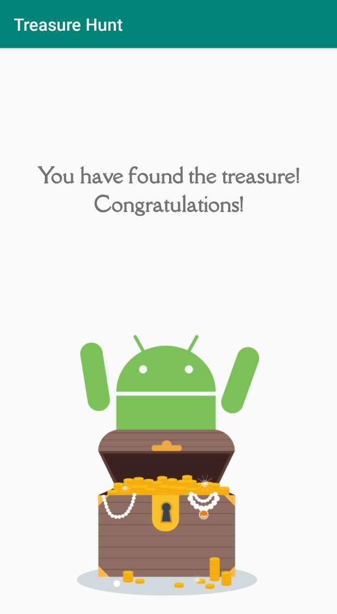
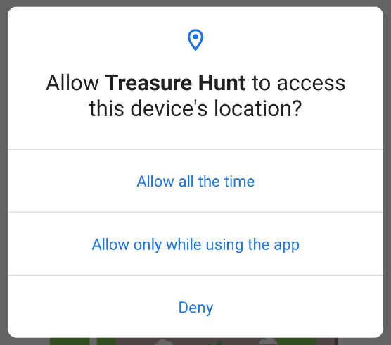
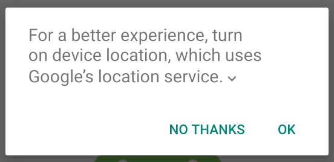

# Treasure Hunt

Virtual Treasure Hunt with Geofences  
Lesson 9 of [Advanced Android with Kotlin course on Udacity](https://classroom.udacity.com/courses/ud940)

Updates:

* Latest library versions (see .gradle files)
* Minor code refactoring

## Introduction

This app is a scavenger hunt that gives the user a clue, and when the user enters the correct location, the app will prompt them with the next clue, or a win screen if they have finished the hunt.

Topics:

* How to check user permissions.
* How to check device settings.
* How to add Broadcast Receivers.
* How to add geofences.
* How to handle geofence transitions.
* How to mock locations in the emulator.

Notes:

* If you are running this app on an emulator, you will need to use another app to pull location data from. This is because geofencing relies on device sensors to detect the location of the device, which the emulator cannot access.
* A minimum of SDK API 29 on your device or emulator. (This should still work on lower API levels but may look different.)
* If you are running API 29 or higher, grant the "Always allow" permission; otherwise, grant "Allow" for location permissions.

## Screenshots

  

